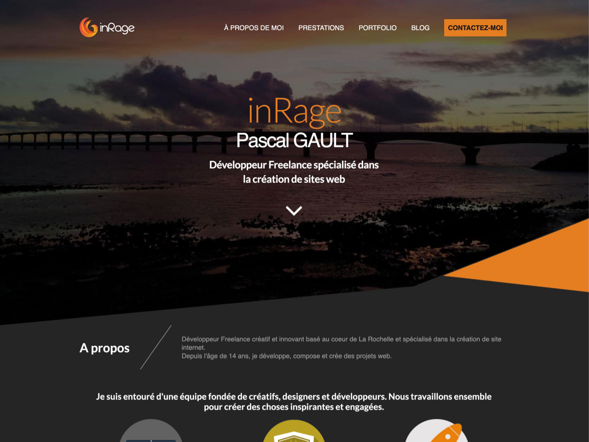

# 2022 Edition - inRage theme 

This version of the theme is compatible with the Full site editing of Wordpress 5.8/5.9 and use Sage 10 in order to manage the whole theme development



## Theme version guide

| Version | Branch | PHP Version | WP Version |
| ------- | ------ | ----------- | ---------- | 
| 2022 | master | 8.0 or greater | 5.8.2 |

Currently based on Sage 10 at the commit [e533e1bd1513790431d9a4fa049458524be7439e](https://github.com/roots/sage/commit/e533e1bd1513790431d9a4fa049458524be7439e)

## Requirements

 Make sure all dependencies have been installed before moving on :

- **WordPress** >= 5.8.1
- **PHP** >= 8.0 (with php-mbstring enabled)
- **Composer** 2.0 or greater
- **Node** 14 or 16 (prefered)
- **Yarn**
- You also need **Advanced Custom Fields Pro**

## Installation

Clone this repository to your theme directory `/wp-content/themes`.

```bash
git clone https://github.com/inrage/wordpress-theme-2022.git inrage
```

Then, to install the theme, run the following commands:

```shell
composer install
```

And install node dependencies and build this project in production mode:

```shell
yarn
yarn build:production
```

## Assets build commands

For the moment, this theme is based on Laravel Mix. 

We will use [roots/bud](https://github.com/roots/bud) when it will be [available on Sage 10](https://github.com/roots/sage/pull/2643).

- `yarn start` — Compile assets when file changes are made, start Browsersync session
- `yarn build` — Compile and optimize the files in your assets directory
- `yarn build:production` — Compile assets for production
